# Data engineer zoomcamp project

In the modern world, where digital platforms generate vast amounts of data every moment, data engineering plays a pivotal role in extracting meaningful insights from these sea-sized datasets. The challenge of processing, analyzing, and storing this data efficiently can't be understated, especially when dealing with resources like https://www.gharchive.org/, which archives public GitHub events.

## Problem Description and Solution

For this project, the focus is on gharchive.org's comprehensive dataset capturing the myriad events that occur on the GitHub platform. Due to its substantial size, employing data engineering techniques becomes imperative. These techniques allow for the effective handling and processing of the data to distill valuable insights.

The primary objective of this project is to ascertain the most common event type generated on the GitHub platform, and to analyze the event behavior over time. Understanding these dynamics not only provides insights into GitHub's usage patterns but also aids in optimizing platform engagement strategies, making data engineering an essential tool in this analysis.

Specifically, the project aims to ascertain the most common event type generated on GitHub and analyze how this event behavior evolves over time. This objective underscores the importance of robust data processing infrastructure and methodologies to tackle the large volume and variety of data efficiently.

## Solution Infrastructure

This project utilizes a host of cloud computing technologies to address the significant challenge of processing gigantic datasets efficiently The project utilizes a suite of Cloud Computing Technologies for efficient data processing due to their scalability, reliability, and performance benefits. 

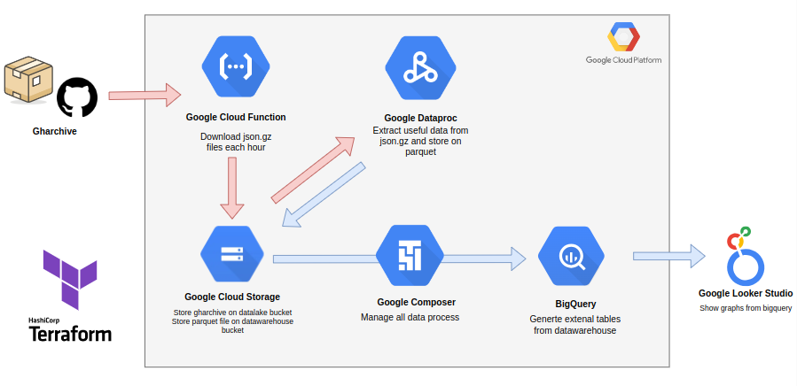

Each component's selection was driven by the need for an efficient, scalable, and cost-effective solution to process and analyze large datasets, demonstrating the project's commitment to leveraging cutting-edge data engineering practices.

### Google Cloud Platform

At the core of our infrastructure is the Google Cloud Platform (GCP), chosen for its robustness, scalability, and a wide range of services tailored for big data projects. GCP's ability to handle vast volumes of data quickly and cost-effectively makes it an ideal choice. The Google Cloud Platform (GCP) was chosen for its comprehensive set of tools, including storage, computing, and data analytics capabilities, which are essential for handling large volumes of data.

### Terraform

Terraform, an Infrastructure-as-Code (IaC) tool, streamlines the management of GCP resources, enabling a reproducible and scalable infrastructure setup. Its declarative configuration files offer a reliable way to provision and manage infrastructure with version control and documentation. Using Terraform allows us to define our infrastructure through code, making it replicable and version-controlled. This approach ensures a consistent and error-free environment setup, enabling quick scaling and adjustments as project needs evolve.

### Google Cloud Composer (Airflow)

Google Cloud Composer, a managed Apache Airflow service, orchestrates data workflows, ensuring tasks are efficiently and reliably processed. Its integration within the GCP ecosystem simplifies complex data pipelines, leveraging Airflow without the administrative overhead. Importantly, data is not processed directly within Airflow to prevent overloading the Composer cluster, illustrating our approach to ensuring a smoothly running, scalable infrastructure. This strategic choice prevents overloading the Composer cluster, enhancing system reliability.

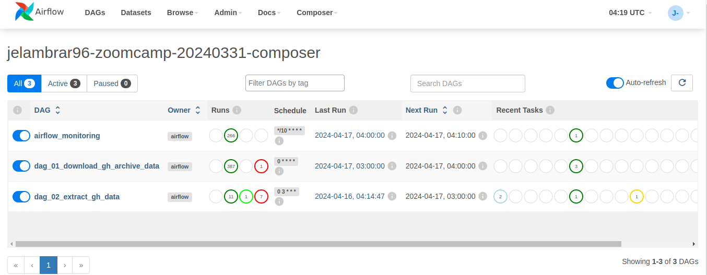


Composer have to main dags:
- **dag_01_download_gh_archive_data:** Execute google cloud function in order to donwload json.gz files. 
- **dag_02_extract_gh_data:** Each 24 hours create a spark job to extract data from json.gz files and stored on data warehouse.

### Google Cloud Functions

For data acquisition, Google Cloud Functions, configured to download GH Archive's JSON.GZ files hourly, demonstrate the flexibility of serverless computing in handling event-driven tasks with scalability and cost-effectiveness. The function's code can be found [here](https://github.com/jelambrar96/data_engineer_zoomcamp_project_jelambrar96/blob/master/gfunctions/download_function/main.py).

### Google Cloud Dataproc

Data processing leverages a Spark cluster on Google Cloud Dataproc to transform 24 hours of downloaded data into query-optimizable, date-partitioned Parquet files stored in Google Cloud Storage. This setup optimizes for processing efficiency and data management. The related Spark code is accessible [here](https://github.com/jelambrar96/data_engineer_zoomcamp_project_jelambrar96/blob/master/dataproc/dataproc_01_extract_gh_data.py).

### BigQuery and Looker Studio

External BigQuery tables facilitate robust data analysis, with Looker Studio employed to visualize and interpret the data, turning complex datasets into actionable insights. We employ Looker Studio for generating insightful graphs and plots, thereby enabling a comprehensive understanding of the event data and its trends over time.

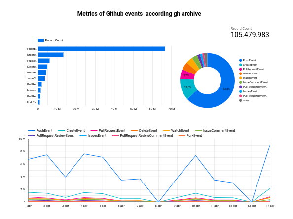

Click [Here](https://lookerstudio.google.com/reporting/b2a0d7ee-267a-497b-9934-ef063f8b40d2/page/09rwD) to access to looker dashboard.


## Steps to Replicate the Project

### Step 1. GPC account
Create a Google Cloud Platform account.

Creating a Google Cloud Platform (GCP) account involves several steps:

1. **Go to the GCP Console:** Visit the Google Cloud Platform website (https://console.cloud.google.com/) and click on "Get Started for Free" or "Try Free".

2. **Sign in or Create a Google Account:** If you already have a Google Account, sign in. Otherwise, create a new Google Account by clicking on "Create account" and following the instructions.

3. **Provide Information:** You'll be asked to provide some basic information, including your name, country, and credit card details. Google Cloud offers a free trial with a $300 credit that can be used within the first 90 days.

4. **Agree to Terms and Conditions:** Review and agree to the Google Cloud Platform Terms of Service and the Google Cloud Free Tier Terms.

5. **Verify Your Identity:** Google may ask you to verify your identity by sending a verification code to your phone number or email.

6. **Set up Billing:** After verifying your identity, you'll need to set up a billing account. This involves providing your billing information and selecting a billing plan. Remember, you'll start with the free trial credits, and Google will not automatically charge you once the credits are exhausted unless you upgrade to a paid plan.

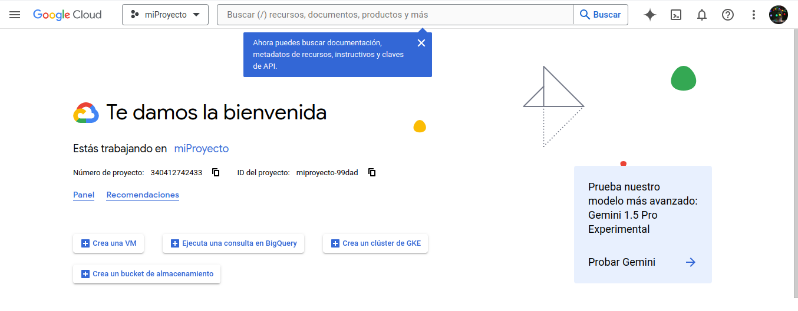

### Step 2. GPC project
Create a Google Cloud project.

To create a Google Cloud Platform (GCP) project, follow these steps:

1. **Sign in to Google Cloud Console:**
   Go to the Google Cloud Console website: https://console.cloud.google.com/
   Sign in with your Google Account if you haven't already.

2. **Open the Project Selector:**
   In the top navigation bar of the Google Cloud Console, click on the current project name (or "Select a project" if you haven't created any projects yet).

3. **Create a New Project:**
   - Click on the "New Project" button in the project selector.
   - Enter a name for your project. Choose a unique and descriptive name that reflects the purpose of your project.
   - Optionally, you can edit the project ID, which is a unique identifier for your project in GCP. The project ID must be globally unique across all Google Cloud projects.
   - Select the organization where you want to create the project. If you don't have an organization, the project will be created under your personal account.
   - Click on "Create" to create the project.

4. **Wait for Project Creation:**
   Google Cloud will create your project, which may take a few moments. Once the project is created, you'll see a confirmation message.

5. **Access Your Project:**
   After the project is created, you can access it from the project selector in the Google Cloud Console. Click on the project name to switch to your newly created project.

6. **Configure Project Settings (Optional):**
   Within your project, you can configure various settings such as billing, APIs and services, IAM (Identity and Access Management), and more. It's recommended to review and configure these settings based on your project requirements.

### Step 3. Create a service account
Create a service account and assign roles. 

1. In the Google Cloud Console, click on the navigation menu icon (☰) in the top left corner.
2. Expand the "IAM & Admin" section and select "IAM" from the menu.
3. In the IAM & Admin > IAM section, click on the "Create Service Account" button at the top of the page.
4. Enter a name for your service account in the "Service account name" field. Choose a descriptive name that reflects the purpose of the service account.
5. Optionally, you can enter a description for the service account in the "Service account description" field.
6. Click on the "Create" button to create the service account.

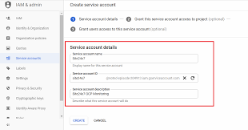

#### 3.1. Assign Roles to the Service Account

1. After creating the service account, you'll be redirected to the "IAM" page.
2. Locate your newly created service account in the list of members and click on the pencil icon (edit) in the "Actions" column next to the service account name.
3. In the "Edit permissions" page for the service account, click on the "Add another role" button.

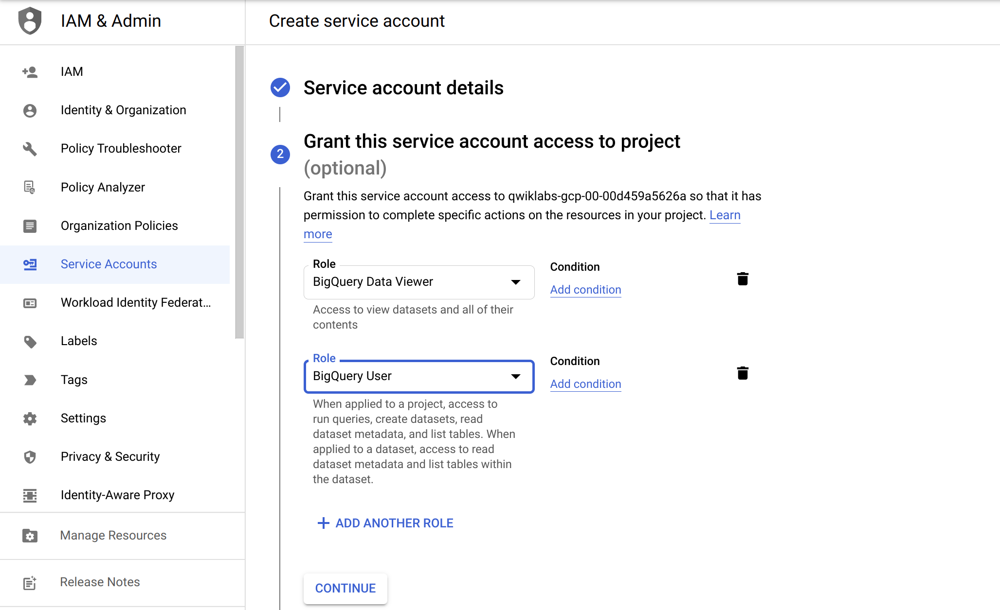

4. Select the role(s) that you need to assign to the service account from the dropdown list. Roles define the permissions that the service account will have.
    - BigQuery Admin
    - Cloud Composer API Service Agent
    - Cloud Composer v2 API Service Agent Extension
    - Cloud Functions Admin
    - Cloud Functions Developer
    - Cloud Functions Invoker
    - Cloud Functions Service Agent
    - Composer Administrator
    - Compute Admin
    - Compute Storage Admin
    - Create Service Accounts
    - Dataproc Administrator
    - Dataproc Hub Agent
    - Dataproc Metastore Admin
    - Dataproc Metastore Managed Migration Admin
    - Dataproc Worker
    - Environment and Storage Object Administrator
    - Environment and Storage Object Viewer
    - Service Account Admin
    - Service Account User
    - Storage Admin
    - Storage Folder Admin
    - Storage Object Admin

5. Once you've selected the role(s), click on the "Save" button to assign the roles to the service account.

#### 3.2. Generate and Download Service Account Key 

- In the "IAM" page, click on the service account name to view its details.
- Navigate to the "Keys" tab and click on the "Add Key" button.
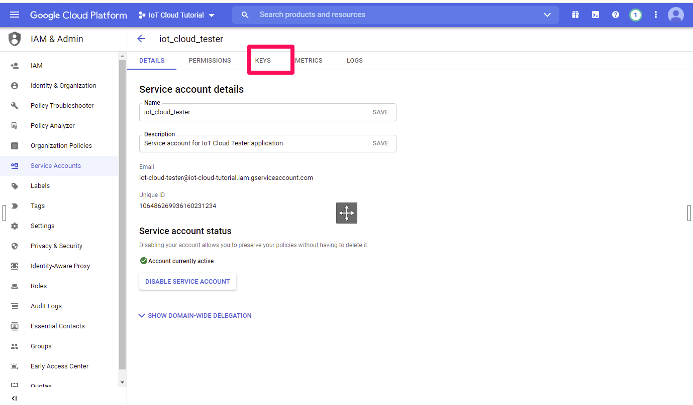
- Select the key type (JSON or P12) and click on the "Create" button. This will generate a new service account key.
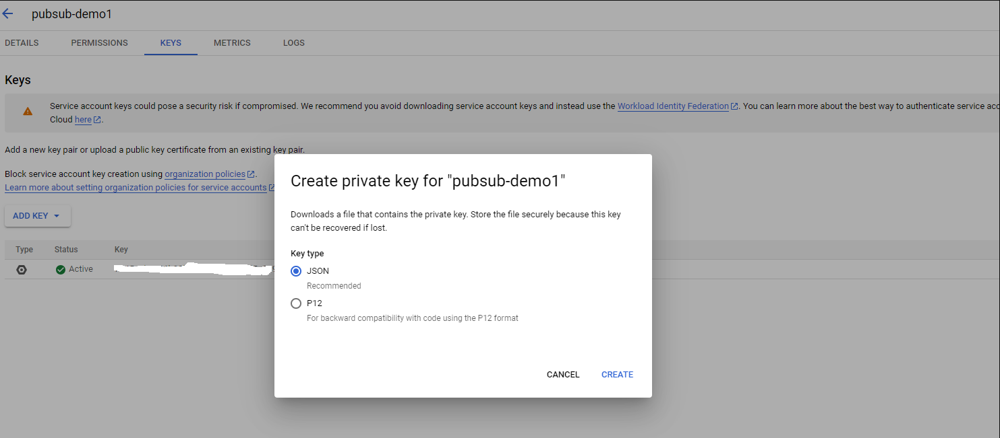
- Download the key file (JSON) securely. Store key file inside `terraform/keys` directory. You can rename the file to `credentials.json` or create a symbolic link.
```bash
ln -s terraform/keys/credentials.json /path/to/file.json
```


### Step 4. Enable Google APIs 
In the API & Services Dashboard, click on the "Enable APIs and Services" button.
This will take you to the API Library where you can browse and search for the APIs you want to enable.

Enable APIs: 
- Environmental 
- Composer API, 
- BigQuery API, 
- Google Storage API 
- Dataproc API.

### Step 5. Configure tereraform

#### 5.1 Create `terraform.tfvars` file

In the `terraform/` folder, create a file named `terraform.tfvars` and set the `project`, `region`, and `zone` parameters accordingly. Look this example: 

```python
project="YOUR-PROJECT-NAME"
region="YOUR-REGION"
zone="YOUR-ZONE"
```

#### 5.2 Add Google Credentials

Remember that your creddentials GPC json key file can be store on `terraform/keys` directory with the name `credentials.json`   

### Step 6. Execute terraform 

1. Execute `terraform init` and `terraform apply` to provision the infrastructure. 
2. **IMPORTANT.** If a BigQuery external table error occurs, it is recommended to wait at least one hour to allow the Spark job to create .parquet files. 
   
### Step 7. Dashboard

Log in to Looker and access Looker Studio. Make sure you have the necessary permissions to create and manage dashboards.

#### 7.1 Create a New Dashboard:
In Looker Studio, navigate to the "Dashboards" tab or section. Look for an option to create a new dashboard, which is typically a button labeled "New Dashboard" or similar.

#### 7.2 Select BigQuery Datasource:
To select a BigQuery datasource for your dashboard, follow these steps:
1. Click on the "Add" or "Add Content" button on the dashboard.
2. Look for an option to add a new tile or content block.
3, In the tile/content block configuration, you'll find an option to select the datasource. Choose BigQuery from the list of available datasources.
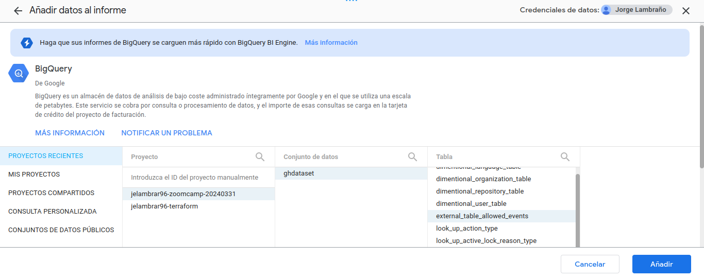
1. You may need to authenticate and authorize Looker to access your BigQuery projects and datasets. 

#### 7.3 Create filter created_at_date
we need create a filter and add on all plots, external bigquery table needs it to works. 
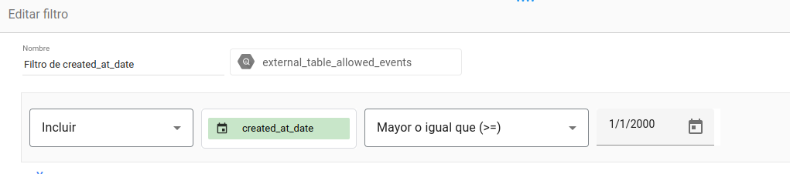 

####  7. Create line plot

Insert a graph. In the Explore, click on the "Visualization" tab.
Select "Line" as the visualization type. This will configure the chart to display a line chart over time.

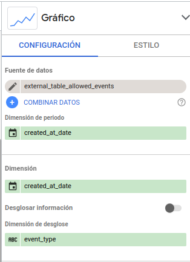

IMPORTANT: You need add created_at_date filter to this plot.
#### 7. Create bar plot 

Insert a graph. In the Explore, click on the "Visualization" tab.
Select "Bars" as the visualization type. This will configure the chart to display a line chart over time.

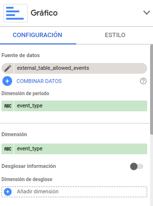

IMPORTANT: You need add created_at_date filter to this plot.

#### 7. Create dount plot

Insert a graph. In the Explore, click on the "Visualization" tab.
Select "dount" as the visualization type. This will configure the chart to display a line chart over time.

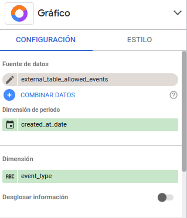

IMPORTANT: You need add created_at_date filter to this plot.

------------

## Useful links

- Datatalks and Data Engineer Zoomcamp Repo: [Here](https://github.com/DataTalksClub/data-engineering-zoomcamp) 

------------

Made with :heart: by [@jelambrar96](https://github.com/jelambrar96) :floppy_disk:

[](https://www.buymeacoffee.com/jelambrar1)
